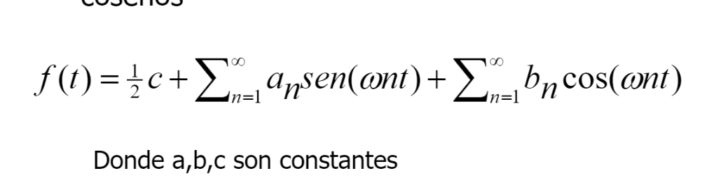
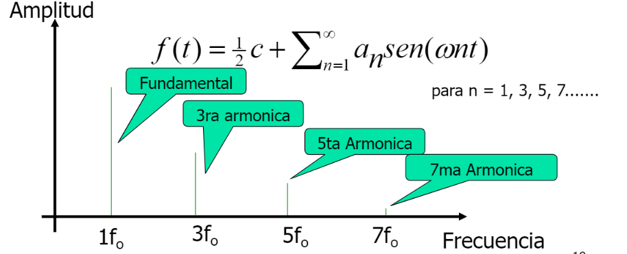
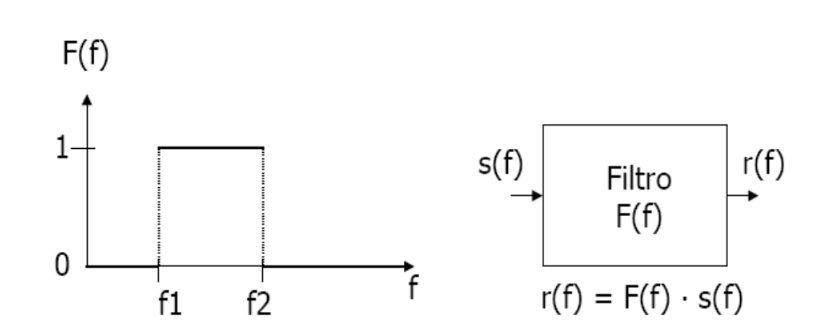
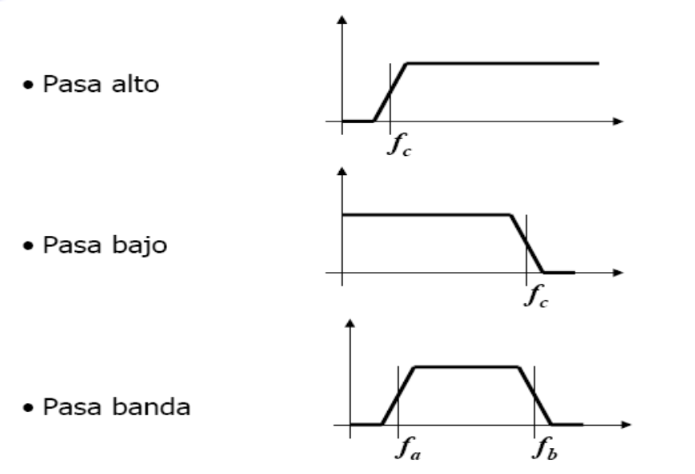

# Ancho de banda

    Frecuencia  en la que una onda es transmitida.
    -Fede se la come a los mordiscones.

# Señal Transmitida

    Se transmite electricidaden en forma de ola a traves del tiempo deformandose poco a poco.
    -Pepsi man.

# Ruido

## Termico

    Medio para transmitir informacion? Cable de Cobre.
    Por que el cable de cobre? Porque no opone resistencia.
    Hay mejores? Obvio, Oro, Platino. Pero salen 2 mamás de Fede.

## Intermodulacion

    Causado pro la no linealidad de las frecuencias que yo trasnmito.
    Resultante  de 2 frecuencias que comparten un mismo medio de transmision generando señales a frecuencias que son suma o diferencia de las dos frecuencias originales o multiplos de estas.

## Diafonia

    Producto de Lineas adyacentes.
    Suma de señales que impactan un cable sobre otro.
    Solucion  a esto? Segun el profe: Meterle un tiro al vecino o Cortarle el cable.

## Impulsivo

    Mucha energia, Mucha frecuencia, en muy poco tiempo
    -Los ejemplos de Fede son comicos, banco.

# To do:

    Trabajo  de investigacion de  suma de ondas{
        Segun el profe es de la clase pasada, asi que, verlo rapido.
        return 0
    }

## Atenuacion

    No es lo mismo que la diafonia, es propia de la distancia proporcional recorrida
    Se puede compensar mediante amplificadores
    Es creciente con la frecuencia
    No es la misma a todas las frecuencias
    Las señales cambian su forma al atenuarse desigualmente sus armonicos

# Teorema de Fourier

    Toda señal periodica se puede considerar formada por la suma de infinitos senos y cosenos
    
    En el caso particular de un onda cuadrada setiene la fundamental y las armonicas impares.
    

## Filtro

    Que es? Dispositivo que deja pasar un rango de componentes de frecuencia y anula el resto
    
      El primer  filtro hace  que pase todo lo que este encima  anulando todo lo  que esta por  debajo, el segundo, pasa bajo, cumple la funcion opuesta, anulando todo lo alto y dejando pasar todo lo alto, el tercero, pasa banda, este tiene limites altos y bajos para que pase una frecuencia entre ciertos limites.
